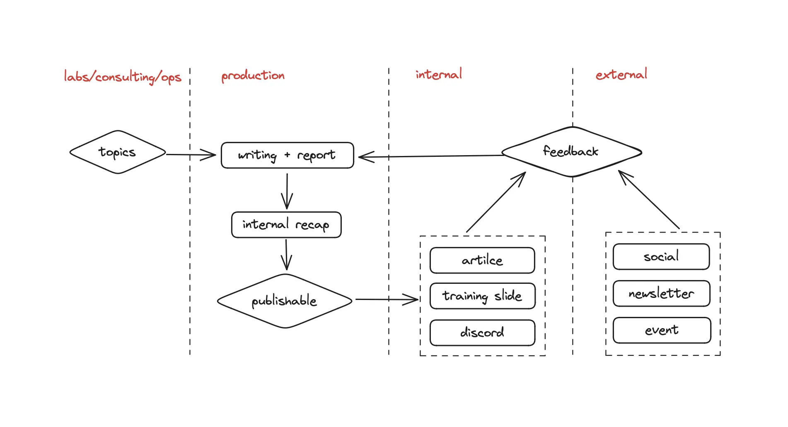

---
tags:
  - communications
  - content
  - guidelines
title: Life cycle of a publication
date: 2024-03-21
description: Following the core theme of MMA (Mastery, Meaning, Autonomy), every piece of content we put out requires a strategic approach, so it can cut through the noise, serve purposes and meanings to readers. Whether we're crafting a note, article, research report, or digital post, the process and cycle remain largely the same...
authors:
  - nikki
menu: playground
type: 
hide_frontmatter: false
---

Following the core theme of MMA (Mastery, Meaning, Autonomy), every piece of content we put out requires a strategic approach, so it can cut through the noise, serve purposes and meanings to readers. 
Whether we're crafting a note, article, research report, or digital post, the process and cycle remain largely the same.

## Recording knowledge
We follow the [Zettelkasten Method](https://www.google.com/url?sa=t&rct=j&q=&esrc=s&source=web&cd=&cad=rja&uact=8&ved=2ahUKEwjd1sqOxYSFAxWJma8BHS9-CmoQFnoECBAQAQ&url=https%3A%2F%2Fzettelkasten.de%2Foverview%2F&usg=AOvVaw3FPgOjz3YA4-_7PSvM22et&opi=89978449) to record and organize knowledge. In short, every new thing we learn is stored as a fleeting note. Fleeting notes are conntected to one another by headings and metadata such as tags or numbers.

Fleeting notes can be personal to each team members, or can be shared through our Playground. When we need to craft a piece of content for a certain topic, we can just pull up related fleeting notes to start.

## Know our audience and objectives
This step guides everything we do next. Before we start, think about who will read our work and what we want them to get from it. Here we can apply a simplified version of the [Virtuous Cycle](https://fourweekmba.com/virtuous-cycle/) to define our audience and objectives.
- What characteristics do the readers have?
- What do the readers want to get from us?
- What can we offer the readers?
- What should we write to answer to what they want?
- How should we write (tone, voice, word choices)?

## Create content
Once we have in mind how we should shape our content:
- Research: dig deep into the topic by pulling up our fleeting notes, we might need to research further to enhance the quality of our content.
- Plan: have a plan for **what** we will create (outline) and **when** we will do it (deadline) and **how** we will measure the effectiveness of our work (metrics).
- Write: write, gather, organize stuff according to the plan, keeping our audience and objectives in mind.
- Format: We write in markdown, using VSCode and follow Dwarves' styling.
- Get reviewed: once we have a draft, submit it as a screenshot to our supervisor/manager for feeback for both content and visual.
- Check and fix: go over our work carefully, several times to fix any errors and make sure it's clear and correct. Come back to our audience and objectives to check if what we write actually meet the brief.
- Get approval: our supervior/manager needs to sign off on the work before we move forward.

## Publish content
Once our work is approved, we have a **literature note** ready for sharing with others. Most written content goes through 5 stages:
- [**Internal recap**](how-to-recap-a-publication.md) within the communications team, so everyone understand it the same way, and can answer to any question readers have.
- Publishing as an article on memo.d.foundation, so everyone has access to it.
- Summary as slides, so we have training materials for everyone who's interested in the topic.
- Workshop, tech event or radio talk with related experts/organizations to widen perspectives on the topic.
- Social and newsletter promotion (optional).

## Talk to our audience
Here is when we know if our content is actually effective for the intended audience. At this stage, it is very important to engage with our audience and people who are interested in our work. Listen to what they have to say, make ways for them to discuss, ask questions and provide feedback to us.

## Refine and upgrade
Keep a close eye on how people respond to our work (by tracking metrics you set out when you plan). Adjust our work based on what's working and what's not.

## Conclusion
We want to contribute as much as we can to the tech community, so making and sharing content is serious business at Dwarves. 
We already have standards and processes in place, following them and adapting them to fit our style and audience will get us high-quality content and become a true contributor to tech.

