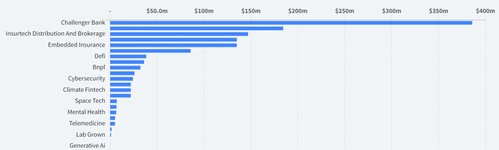
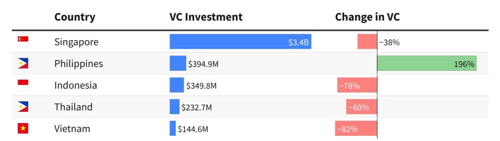

## AI sector
[**Nvidia's Personal AI Supercomputer**](https://www.wired.com/story/nvidia-personal-supercomputer-ces/): Nvidia has unveiled Digits, a $3,000 desktop AI supercomputer designed for researchers and enthusiasts. This compact device boasts an Nvidia GB10 Grace Blackwell "superchip," 128GB of unified memory, and up to 4TB of storage, capable of running large AI models with up to 200 billion parameters.

[**Microsoft's Mini AI PCs**](https://www.theverge.com/2025/1/2/24334251/microsoft-copilot-plus-mini-pcs-ces-2025-notepad): Microsoft is set to introduce mini PCs equipped with Copilot Plus features, enhancing functionalities like Recall and AI-powered image editing in Windows 11. Asus and Geekom are among the manufacturers launching devices with dedicated Copilot buttons, signaling a move towards more AI-integrated personal computing.

[**Omi: The AI Companion Wearable**:](https://www.theverge.com/2025/1/8/24338750/omi-ai-wearable-friend-companion) Omi is a new $89 AI wearable designed to act as an always-listening digital assistant, capable of summarizing meetings and offering personal mentorship. Developed by Nik Shevchenko, Omi aims to understand and respond to user needs in real-time, with future aspirations towards integrating brain-computer interfaces.

[**AI Hardware's Critical Phase**:](https://www.wired.com/story/ces-2025-ai-hardware-is-in-its-put-up-or-shut-up-era) At CES 2025, the focus is on integrating AI into existing devices rather than creating new AI-specific hardware. The previous year's dedicated AI gadgets underwhelmed users, leading companies to embed AI as one of multiple features in products like smart glasses, enhancing overall user experience.

## Blockchain
[**Worldcoin's New Orb and Expansion**](https://www.wired.com/story/worldcoin-sam-altman-orb/): Sam Altman's company, Tools for Humanity, has rebranded its Worldcoin project to the World Network, introducing a new Orb for biometric iris scanning. The device will be available through various channels, including home delivery in Latin America, aiming to verify human identity in an AI-driven world.

[**Convergence of Immersive Tech, Blockchain, and AI**:](https://www.weforum.org/stories/2024/06/the-technology-trio-of-immersive-technology-blockchain-and-ai-are-converging-and-reshaping-our-world/) The integration of spatial computing (AR/VR), blockchain, and AI is reshaping digital interactions. This convergence enhances user experiences across industries like retail and financial services, enabling more secure, transparent, and personalized digital engagements.

## Others
[**Sony's Xyn VR Headset Prototype**](https://www.theverge.com/2025/1/6/24337597/sony-xyn-vr-headset-prototype-3d-games-movies): Sony has unveiled Xyn, a prototype "extended reality" headset aimed at creators of 3D content for films, animation, and games. Featuring 4K OLED displays and video passthrough, Xyn is designed to integrate with third-party design and modeling software, enhancing creative workflows.

[**Google's AI-Powered Smart Glasses**:](https://www.wired.com/story/google-android-xr-demo-smart-glasses-mixed-reality-headset-project-moohan/) Google is set to release AI-powered smart glasses and the Android XR platform, marking significant advancements in AR and VR. These glasses offer real-time translations, object recognition, and contextual awareness, utilizing Google's Gemini voice assistant, aiming to provide a comprehensive mixed-reality experience.

[**Snap's AR Spectacles 2024 Edition**](https://www.wired.com/story/snap-spectacles-2024-hands-on/): Snap has launched the 2024 edition of its augmented reality Spectacles, enhancing user interaction through creative AR capabilities. While primarily targeted at developers, these glasses feature a 46-degree AR display and standalone functionality, aiming to foster social connectivity through shared AR experiences.

[**CES 2025 Tech Innovations**](https://www.theverge.com/2025/1/4/24335163/ces-2025-what-to-expect-tvs-smart-home-auto): CES 2025 showcased a range of tech advancements across various sectors. Highlights include giant OLED and Mini LED TVs with AI-powered features, smart home products leveraging the Matter standard, and next-gen GPUs from Nvidia and AMD, indicating a year poised for significant technological growth.

## South east Asia Q4 2024 Venture Capital Highlights
### Industry highlights
**Challenger Banks:**
- **Definition:** Digital-first financial institutions that operate without physical branches, focusing on streamlined banking experiences.
- **Why It's Leading:** Massive growth in demand for online banking services, driven by financial inclusion initiatives and increasing mobile adoption across SEA.

**Insurtech Distribution and Brokerage:**
- **Definition:** Technology-driven platforms facilitating insurance sales and customer management.
- **Why It's Growing:** The need for simplified insurance distribution channels and digitization of customer acquisition has fueled investments here.

**Embedded Insurance:**
- **Definition:** Insurance services integrated directly into non-insurance platforms, such as e-commerce or fintech apps.
- **Why It's Expanding:** Companies seek to offer additional value by bundling insurance products with primary services, enhancing customer retention.

**DeFi (Decentralized Finance):**
- **Definition:** Blockchain-based financial services eliminating traditional intermediaries, like banks, in transactions.
- **Why It's Booming:** SEA has a high unbanked population and DeFi platforms offer accessible financial tools directly on the blockchain.

**BNPL (Buy Now, Pay Later):**
- **Definition:** A short-term financing model allowing consumers to make purchases and pay in installments.
- **Why It's Rising:** Increased e-commerce activity and consumer preference for flexible payment options have driven growth in BNPL platforms.

### Top regions for Investment

- **Singapore:** Led the region in total VC investment, attributed to its stable regulatory environment and strong startup ecosystem.
- **The Philippines:** The fastest-growing market in 2024, fueled by digital infrastructure investments and a surge in e-commerce activity.
- **Manila:** Emerged as the fastest-growing city hub, reflecting a surge in tech adoption and new business formations.

Source: [dealroom.co](https://dealroom.co/)