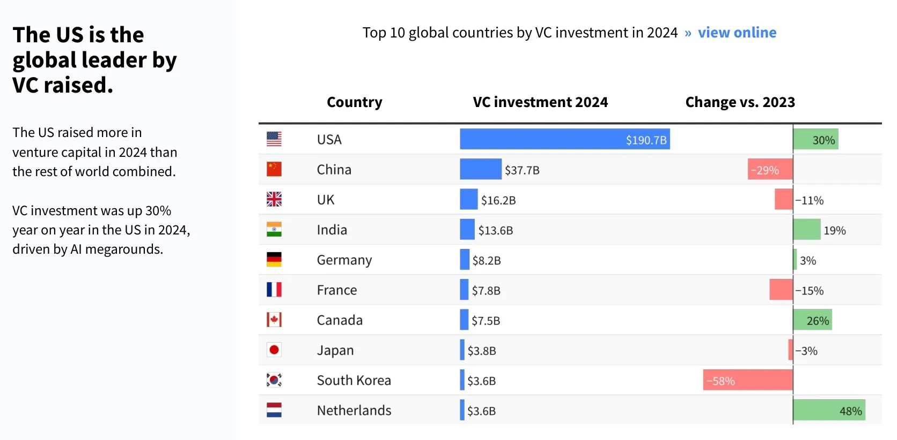
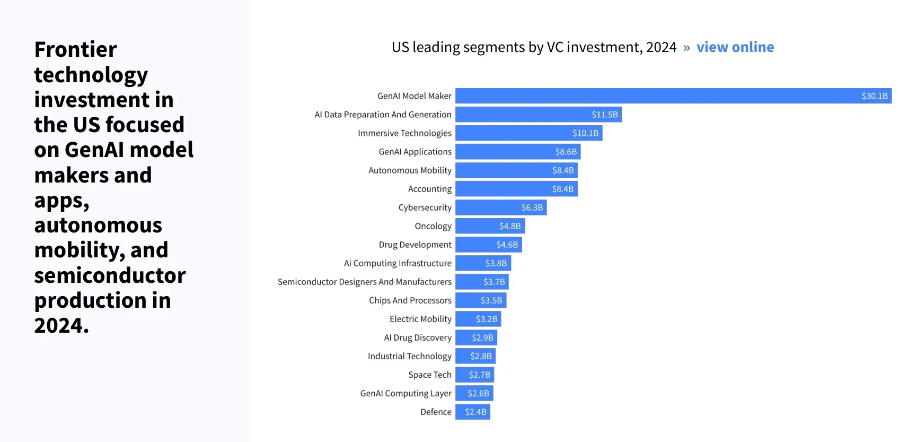

## Follow the Money
### 1. The US: Golden Ticket
- **Why It Matters**: The US alone raised $190.7B in VC funding in 2024, more than the rest of the world combined. With a 30% year-over-year increase, it’s clear that American startups are ready to invest in rapid scaling and cutting-edge technologies.

    

### 2. High-Growth Markets to Watch
- **India** (+19%) and **Canada** (+26%) are surging in VC investments, signaling a growing appetite for tech solutions.
- The **Netherlands** leads in growth (+48%), making it a promising market for cost-effective, high-quality services.

### 3. Cost-Sensitive Regions: A Strategic Advantage
- **Insight**: Regions like **China (-29%)** and **South Korea (-58%)** face significant funding declines. Startups here will likely prioritize cost-efficient solutions to maximize limited budgets.

### Sector-Specific Opportunities: Where to Focus

### AI is still the Kingmaker
- **Key Figures**: AI-related fields dominate US investments, with $30.1B in GenAI model makers, $11.5B in AI data preparation, and $8.6B in GenAI applications.

### Immersive tech and Autonomous Systems: Rising Stars
- **Opportunity**: Immersive technologies raised $10.1B, and autonomous mobility secured $8.4B in VC funding.
- AR is gaining traction in sectors like e-commerce (virtual try-ons), healthcare (surgical simulations), and education (interactive learning).
- VR applications are expanding into gaming, virtual meetings, and therapy solutions.

## Blockchain
**Dubai's DAMAC Partners with MANTRA for $1 Billion Asset Tokenization**

[Dubai-based developer DAMAC Group](https://www.reuters.com/technology/dubai-developer-damac-signs-1-bln-deal-with-blockchain-platform-mantra-2025-01-09/) has entered into a partnership with blockchain platform MANTRA to tokenize $1 billion worth of Middle Eastern assets. This initiative aims to convert ownership rights into digital tokens, facilitating online trading and enhancing product offerings. The tokenized assets are expected to be available on the MANTRA chain early this year.

**Brickken Secures $2.4 Million to Advance Asset Tokenization**

[Barcelona-based startup Brickken](https://cincodias.elpais.com/companias/2025-01-15/la-startup-brickken-cierra-una-ronda-de-24-millones-para-impulsar-su-negocio-de-tokenizacion-de-activos.html), specializing in the tokenization of real-world assets, has closed a $2.5 million seed funding round, valuing the company at approximately $22.5 million. The funds will support Brickken's expansion in Europe, North America, and Asia, as well as enhance its technological platform with advanced enterprise solutions and AI integration.

**Coinbase Introduces Bitcoin-Backed Loans**

[Cryptocurrency exchange Coinbase](https://www.investopedia.com/coinbase-is-offering-loans-against-your-bitcoin-8775589) has launched a service allowing users to secure loans up to $100,000 against their Bitcoin holdings. The loans are provided in USD Coin (USDC) without requiring a credit score, with the loan amount based on the Bitcoin offered as collateral. This service enables users to access funds without selling their Bitcoin, potentially avoiding capital gains taxes.

**MiCA Regulation Guides Digital Asset Expansion in Europe**

[The Markets in Crypto-Assets (MiCA) regulation](https://cincodias.elpais.com/criptoactivos/2025-01-16/reglamento-mica-la-brujula-que-guiara-la-expansion-de-los-activos-digitales-en-europa.html) was introduced in Europe in January 2025 to regulate digital assets, addressing challenges like volatility and cybersecurity risks. This framework aims to provide security, transparency, and trust in the crypto market, requiring providers to register and obtain authorization to operate in the EU, thereby reducing systemic risks and promoting market stability.

**UK's 'Debanking' of Crypto Firms Raises Concerns**

[A survey of UK fintech and crypto firms](https://www.forbes.com/sites/lawrencewintermeyer/2025/01/16/no-country-for-young-fintechs-the-uks-debanking-of-crypto-blockchain-and-web3/) revealed that 50% have been rejected when attempting to open bank accounts. This 'debanking' trend poses significant challenges for the growth and operation of crypto and blockchain startups in the region, prompting calls for regulatory intervention to address the issue.

## Artificial intelligence (AI)
**Taiwan Advances AI Chip Production with New Plant**

[Taiwan has strengthened its role in AI chip production](https://apnews.com/article/taiwan-artificial-intelligence-chip-factory-spil-1e087e92592b0b9ab7fb20442a5b8dc7) with the inauguration of a new factory by Siliconware Precision Industries Co. (SPIL) in Taichung. The facility aims to innovate AI chip packaging technology and integrate silicon photonics for enhanced system capabilities, reinforcing Taiwan's critical position in the AI supply chain.

**Google Integrates AI-Generated Answers into Search Engine**

[Google is implementing a significant update](https://www.thesun.ie/tech/12966220/google-search-major-change-ai-openai-chatgpt-gemini/) to its search engine by incorporating AI-generated answers, marking the most substantial change in 25 years. The AI Overviews feature provides direct responses to queries at the top of search results, moving beyond the traditional list of links. Following successful trials, this feature is being rolled out in the US, with plans to expand to other countries.

**OpenAI CEO Predicts Emergence of Autonomous AI Agents**

[OpenAI CEO Sam Altman](https://arstechnica.com/information-technology/2025/01/sam-altman-says-we-are-now-confident-we-know-how-to-build-agi/) expressed confidence in the development of artificial general intelligence (AGI), stating that the company is now confident in its ability to build AGI as traditionally understood. He also predicted that by 2025, AI agents capable of performing complex tasks may enter the workforce, significantly impacting company operations.