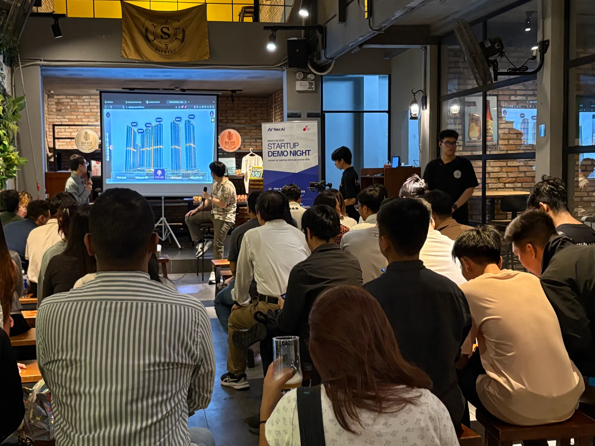

Hey everyone. I went to 2 cool events in Vietnam recently and I’ve got some fun thoughts to share. Tired of boring tech talk? I’ll tell you what I saw and what got me excited or curious. No big words, just my real take. Let me know what you think.

# First Stop: XDC Network to the World, Building Asia's Web3 Ecosystem Roadshow

I showed up at this Web3 event hoping for something big. It was pretty quiet though. A few years back Web3 felt wild and free, startups had crazy fun ideas. This time it was more people in suits playing it safe. I thought Web3 was about breaking rules so I wondered: is it changing? Maybe it’s just this event. My friend Terrance said some builders don’t come to these things, they’re out there making stuff on their own. That’s cool to think about. The talks got lively when investors got excited about trading apps the Vietnam government likes. 

I talked to one VC from Southeast Asia who said they’d love to put money into government-backed CEXes. They think it’s the future, big groups jumping into crypto. It sounds like an easy win. Some people said governments might push out platforms that don’t follow rules but others think it’s a chance to grow. In November 2024, a [Chainalysis report](https://www.chainalysis.com/blog/central-southern-asia-crypto-adoption-2024/) said Vietnam got $100 billion in cryptocurrency inflows. Most of this came through **centralized exchanges** CEXes. Big investors, and retails like using them. Plus, the [VnExpress article from January 2025](https://vnexpress.net/de-xuat-thu-nghiem-san-giao-dich-tien-so-tai-trung-tam-tai-chinh-4837314.html) shows the Ministry of Planning and Investment pushing to test-run crypto trading platforms in places like Ho Chi Minh City and Da Nang by 2025

Here’s why Vietnam’s government wants to help these exchanges grow:

- Rules That Work: They can stop the crypto mess from going wild, keeping it safe and legal, and no shady scams allowed.
- More Jobs, More Money: More exchanges mean more gigs and cash for Vietnam. It’s a win for workers and the economy.
- New Tech Vibes: It gets people cooking up fresh tech ideas, making Vietnam look smart and cutting-edge.
- Tax Cash: They can grab some tax money from all those crypto trades. With billions flowing, taxing profits means more bucks for stuff like roads and schools.
- Big League Status: It puts Vietnam on the global crypto map, pulling in big investors and making the country look legit.

# Next Up: What’s Up HCM, Startup Demo Night

A few days later I hit a startup night in Ho Chi Minh City. Wow what a difference. AI startups showed off some amazing stuff. VCs couldn’t take their eyes off one AI that fixes order mistakes, it’s a big deal for businesses. I think it’s super smart even if it might mean fewer jobs. It’s a win for companies and I can see why they’re excited.

I met Justin from [Costella.](https://www.costella.co/) He said the tech world’s changing, less hiring of newbies and more focus on skilled pros because the market’s shaky. He’s built a cool tool that figures out your emotions from how you talk. He’d love your help testing it, try it out and tell him how it could help you or your business. Then I talked to Eduardo from [Asserto.](https://asserto.ai/) He’s been a developer for over 20 years, through dot-com days, web apps, and mobile apps, and says this AI wave is the wildest yet. He’s making a platform to test prompts and needs testers, plus a sales person and a frontend dev. Give him a hand if you can. 

I also met Jeremy from [Nex AI](https://www.nexai.app/), and he’s super cool. His team made a tool that helps businesses by doing data entry for them. It saves money and time, so companies don’t have to deal with boring paperwork. The error rate is super low, and it can scan PDFs and pictures too. Johnathan said they’re testing it in Vietnam with some startups who love how fast it works. Really neat for big or small businesses. They’re in Singapore and looking for more people to try it out here. It’s simple, smart, and cuts the junk work. Worth a look if you want to save cash. 

These innovations reflect a broader AI boom in Vietnam and South East Asia. According to [OpenGov Asia](https://opengovasia.com/2025/02/08/vietnams-ai-future-innovation-policy-and-growth/), 80% of Vietnamese businesses embraced AI last year, topping the regional average of 69%. At QVIC 2024, 70% of solutions featured AI to tackle business challenges. Fueling this surge, NVIDIA’s new AI-focused R&D center in Vietnam is set to drive further innovation and open doors for tech talent.

Not everything was great. Some AI chat tools were for small silly stuff, kind of weak. One guy called his idea “big news” but it felt fake so I tuned out. Still the good ones solve real problems and the crowd was pumped. New people are coming to Vietnam to start things, it’s a vibe I could feel even if I didn’t count them. 

That was my week, and I’m feeling good about it. The Web3 event showed me things are shifting, maybe getting ready for something bigger. The AI night was bursting with fresh ideas, and even with some worries, the energy there was electric. Vietnam’s alive with people chasing dreams and building cool stuff. I think we’re onto something real here, not just noise, and it’s only going to grow. What do you think? Can’t wait to see what’s next. Catch you soon.
