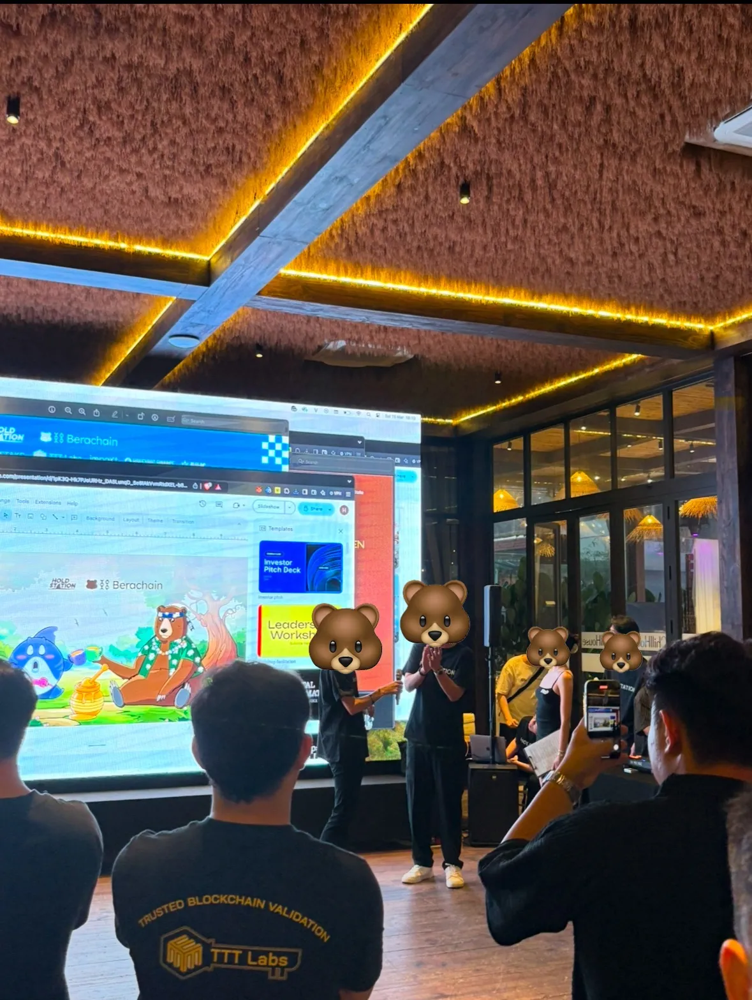
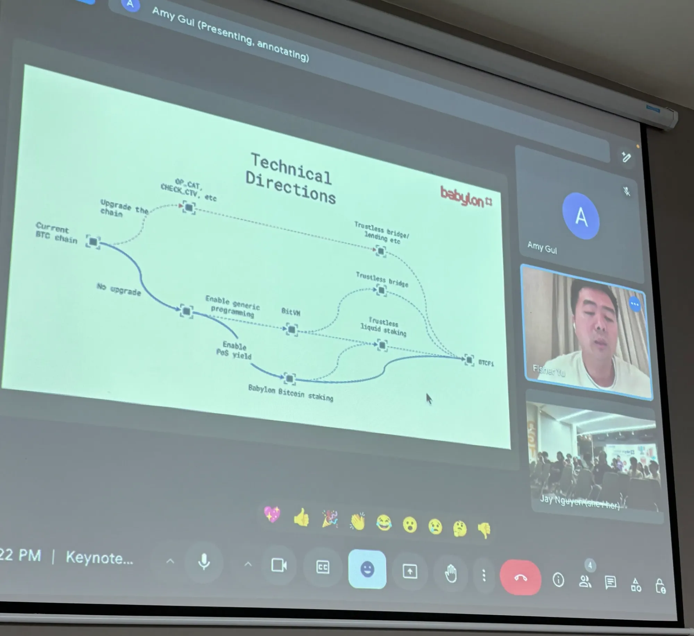
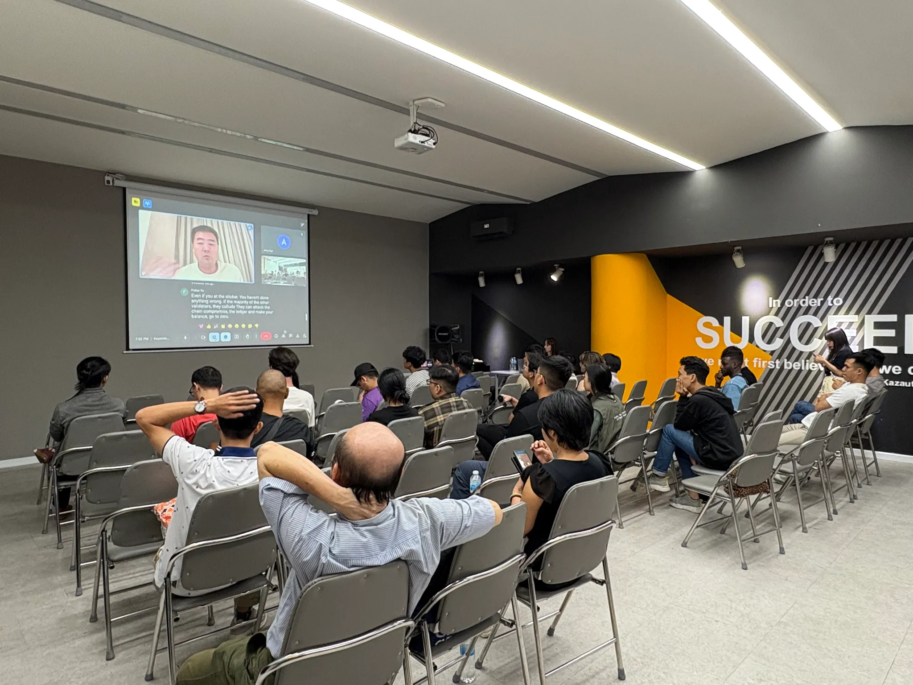

I recently went to two Web3 events in Vietnam: Berachain and Babylon. Both were full of energy, with people excited to talk about the future of cryptocurrency. Here’s what I learned, with some cool ideas from Berachain’s community approach mixed in.

### Berachain: Growing in Asia with a Fun Community

At the Berachain event, everyone was focused on growing in Asia, places like Malaysia, Indonesia, Hong Kong, and Vietnam. Asia has tons of people online, so it’s a great spot for crypto projects to expand. With over 2.93 billion internet users in Asia as of 2024, it’s no wonder projects are flocking here.

But there were some challenges. People said it’s really hard to find local experts who know how to market Web3 projects. And it’s not just talk, there are only 23,000 Web3 developers globally compared to 26 million in Web2, making talent scarce, especially in Southeast Asia, according to AngelHack. But that’s more like an industry problem:

This has become the consensus and most of the comment section agreed with this take. Some argued that it happened in most industries, while some stated it was simply because talents coudn’t keep up with this space’s rapid change. Another problem is token prices. When prices go up, everyone’s happy, lots of people join and groups get active. But when prices drop, it gets quiet. It’s hard to keep things going strong all the time.

Berachain is doing something different. They’re building a fun community with memes and ideas people connect with, like bears, tho they prefer to be referred as “beras”. They’ve got accounts that post funny stuff, making the project feel friendly and exciting. This could attract talented people who get both tech and local culture.

They also have programs that rewards people for helping out, teaching others, spreading the word, and staying active. They give out things like airdrops and NFT whitelisted spots tied to their bera themes. This keeps their community strong, even when the market isn’t doing well. In Asia, where regular marketing can feel useless, this could work really well.

However, Ethereum built its whole vibe on sharing free code with everyone and keeping things super decentralized, no bosses, no central control, just pure tech freedom. But the ETH community sentiment is at all-time lows right now. There’s absolutely no sustainable playbook for growth here.

### Babylon: A New Way to Use Bitcoin

At the Babylon event, they talked about a new idea: a way to earn extra money (yields) from altcoins while keeping your Bitcoin safe in your wallet. You don’t have to move it anywhere, and they’re even building their own blockchain. People were pumped but also careful, asking things like, “Is my Bitcoin safe?” and “Where do the rewards come from?” With Bitcoin’s market cap exceeding $1.6 trillion now, it’s understandable why people are cautious about new staking ideas.

This could be huge cause most of Bitcoin holders don’t do anything with them, they just HOLD them? I do see a use case gap for the maxis, but there are worries. This protocol give out rewards/yields as alt-coins. The altcoins you earn might lose value fast. Plus, the tech is new, and people want proof it’s secure before they trust it with their Bitcoin. Still, it’s an exciting idea. They’ve just had the airdrop snapshot for the community, which could help it grow. Anyways, event’s rated as 5/10, too much technical jargon was mentioned. The room was full when I came in, nearly half left during the presentation. Guess the majority still don’t care about the technical stuff, they probably just want their portfolio to go up. That’s some tips for the presenters, mention the audience’s bags.

Okay, so I hit up these events. It’s definitely got some potentials, but it’s got some real headaches too like where do you find enough brainy folks to make it all work, and how do you deal with the market going wild one day and crashing the next? Berachain’s got this chill vibe going, trying to build a fun, tight-knit crew, and that could totally patch up some of these problems. They’re not just obsessing over token prices like everyone else, they’re betting on people sticking around for the long haul, which might actually make something that doesn’t die out fast. Then there’s Babylon, going in with this idea that could flip the script, even if it’s got some sketchy risks. 

Asia’s got the people and the hype to pull off Web3, no doubt, but it needs some clever moves to really take off. Berachain’s whole “let’s make a community people love” thing could be the secret sauce showing it’s not just about getting huge, it’s about creating a spot where folks wanna hang. Honestly, I’m kinda over the quick cash grabs; we should be building vibes and cultures that stick around.