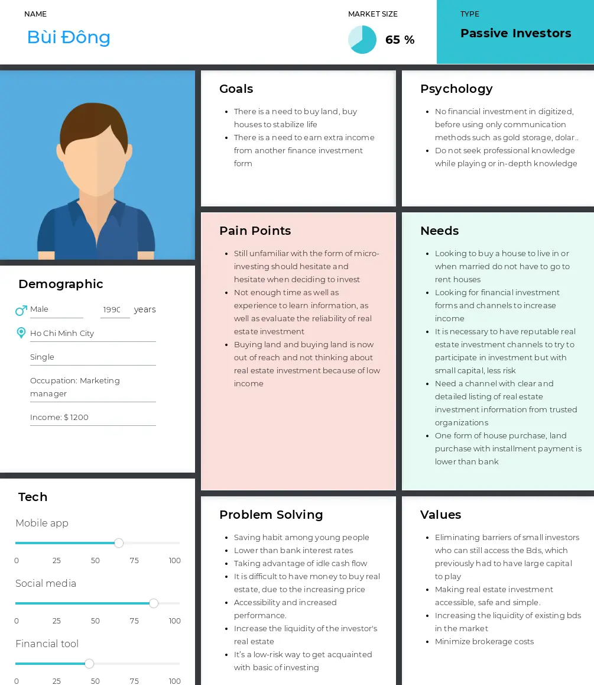

## How is the real estate market moving?

* When an industry begins this journey of digital transformation depends largely on the specific nature of its offering. As a rule of thumb, the more product-oriented and direct-to-customer an industry is, the sooner its digital transformation journey begins.

### The first important question is: why do industries go through this transformation process? What is the overall purpose?

* One common misconception is that fear is a major driver of transformation - the fear of being disrupted, the fear of becoming obsolete, the fear of losing out. Whilst it is true that fear drives action in some instances, the true driver behind digital transformation is capitalism in its most simple form - otherwise known as profit. Profit drives capitalism and, within regulatory and moral frameworks, a business must logically pursue profit at all cost and real estate can not stand outside this game although it can be considered as a business has been present for a long time and very stable since the human society was formed but not so that it stopped developing.
* In addition to the traditional word of mouth marketing, consumers are increasingly accessing real estate information via the Internet. Technology has a great impact on changing consumer behavior, promoting the application of technology in real estate. When customers' behavior changes, real estate businesses need to grasp this trend in order to increase access to customers, thereby increasing profits.

## Why does micro-investing form appear?

* The concept of micro-investing is a relatively new one. In the past, investing was reserved for only those with bulging wallets. In recent years, micro-investing has gotten very popular, particularly with millennials, born and raised in the technology era, this is a great opportunity just getting started with investing. Micro investing is the perfect way for millennials or any other generation to begin investing.
* So-called micro-investing in private real estate is an increasingly accessible option for investors looking to diversify their portfolios with small-dollar value investments. By micro-investing, you’re investing small sums of money sometimes even just spare change and collecting returns slowly. You don’t really need any specific investing knowledge to start micro-investing

## How it works

* Micro-Investing Platform is a common property purchase model, to encourage people to invest, even when they have limited incomes and assets.
* Investors can choose appropriate property vs investment taste, then spend a small amount in accordance with their finances. Investors can pay the registered part or pay according to the set payment schedule. At the time of sale, the investor will receive a percentage based on market share

## Factors that make this model feasible

* We have a huge portion of the population that is eager to invest in real estate, provided it proves to be an easy and affordable investment.
* They don't need to learn the complex method, rules but it still simplicity and accessibility
* Millennials keen to automate nearly every part of their lives, it’s no surprise that micro-investing has become incredibly popular amongst the demographic
* Micro-investing companies give investors the ability to become part-owners of specific properties which creates lower fee structures, favorable tax benefits, and assets that are not tied to the stock market.

> A simple, efficient way to invest small amounts of money into an otherwise inaccessible market for many investors

## Overview insight about Proptech in general micro-investing in Viet Nam

* The largest market share in the listing and marketplace niche
* Micro-investing is very modest with five products just established in 2018-2019, the companies are very new and foreign-invested, or the founder is overseas Vietnamese has launched this business in Vietnam.
* This shows that Proptech in the Vietnamese market is growing day by day because the rapid and outstanding development of technology has a great impact on changing consumer behavior, promoting the application of technology in real estate. As customers' behavior changes, real estate businesses need to grasp this trend to increase access to customers.

## Target consumer

### The challenge of the micro invest model for persona that this model is aiming for

* Change user perception of changing real estate trading habits from traditional to digital
* Improve knowledge about personal finance in general as well as provide, educate knowledge about real estate such as market trend, the law of real estate .. in particular.
* Difficulties in eliminating the underlying fear of the risks involved in this field as well as the benefits of having more passive income sources, less risk, less volatile market prices than other forms

## The impact does COVID-19 have on changing market trends and the opportunity for real estate to grow in the future

* Technology has a great impact on changing consumer behavior, especially in the context of the COVID epidemic affecting the real estate industry in general, promoting the application of technology in real estate to increase access to customers.
* Some real estate businesses have changed their business plans, implemented sales applications, used video ads, 3D scanning; or Livestream brokers to introduce products to customers to support shoppers' partners. By applying technology, customers can know information about the project, visit the apartment through virtual reality with just a smartphone, and help customers save time and create flexibility. Be proactive to customers and limit the movement of crowded contacts during the epidemic season. This is a factor promoting online transactions in the field of real estate.
* Many investors are also quick to embrace technology trends, build smart cities, have automated and modern control systems, environmentally friendly, increase the safety and convenience of residents. In addition, the project owner hopes to earn higher profits by reducing the dependence on the broker by setting up a separate brokerage team or selling through technology applications..
* Besides, when environmental pollution is high, disease outbreaks, people are more concerned about health care. One of the real estate enterprises 'responses to the Covid-19 epidemic is to restructure their products, through green projects, to bring peace of mind to residents' health in order to stimulate demand for healthy living, quality of current home buyers
