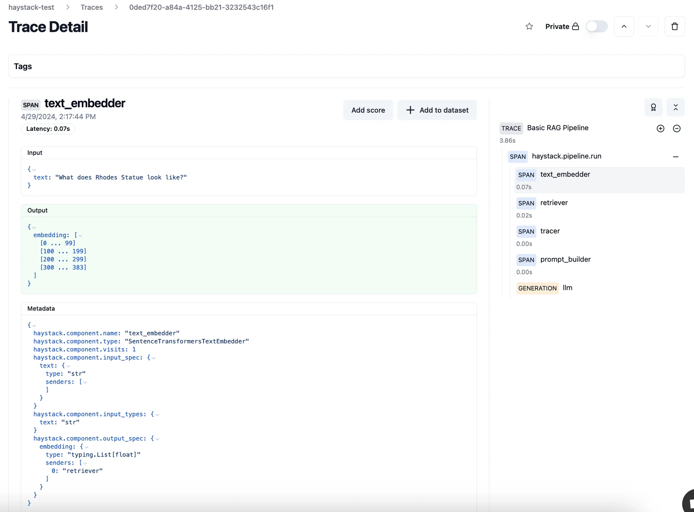
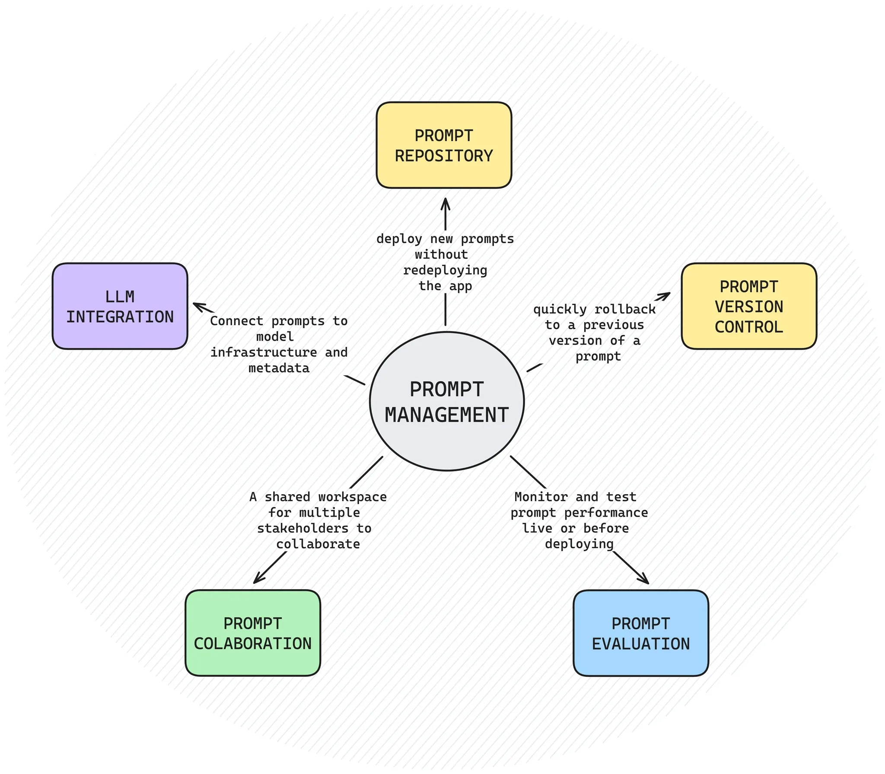
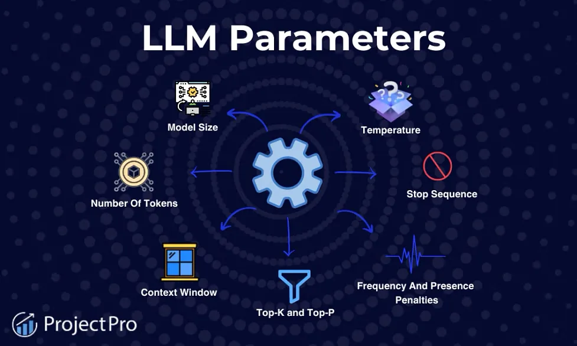
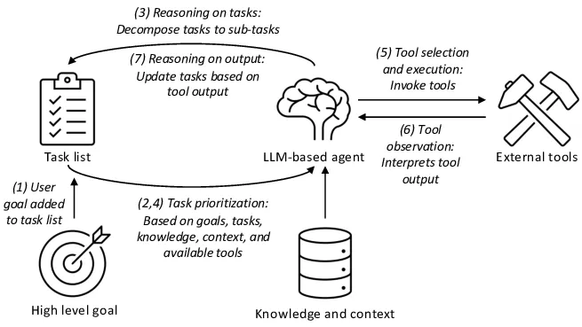
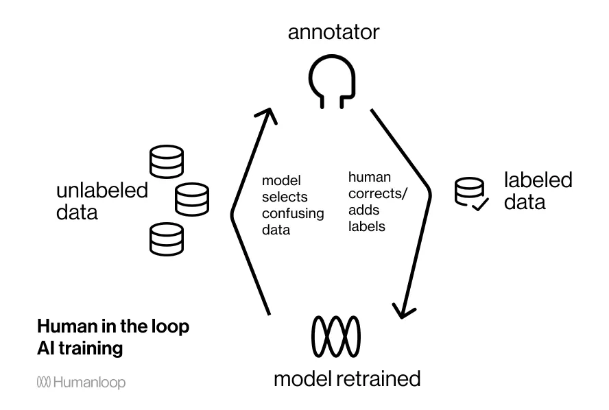

---
authors:
  - 'datnguyennnx'
date: '2024-10-11'
description: 'Logs are like the footprints of your LLM, tracking every move it makes. We will look at how logging can help you see beneath the top layer of a system, which can help you troubleshoot problems and better understand the system behavior.'
hashnode_meta:
  coverImageOptions:
    coverImageURL: 'https://memo.d.foundation/playground/ai/building-llm-system/assets/logs-pillar-sample-rag-system.webp'
  id: '670f4d47aec5a6a939f51323'
  slug: 'logging'
sync: 'hashnode'
tags:
  - 'llm'
  - 'observability'
  - 'log'
  - 'pillar'
title: 'Logging'
---

When you’re working with generative AI application, one thing that often gets overlooked is logging. Logging helps you keep track of what’s happening under the hood and gives you the insights you need to improve your model. Whether it's detecting errors or maintaining your AI runs smoothly, logging is fundamental. In this article, we'll look at why logging is important and how to use it to improve your LLM application.

## Roles of logging in LLM application

So, what’s logging? In simple terms, it’s about keeping a record of what happens between users and large language models (LLMs). This means saving both the questions users ask and the answers the model gives.

If you look at the image below, it shows how an LLM app works. Logging is a key part of this because it captures things like the model’s inputs, outputs, the current state, memory being used, and the prompts running. This helps us see the big picture and keep track of how well the system is doing.

## The impact of logging

### Enhancing user experience

Logging everything gives you a clear view of how users interact with your system. By tracking every query, output, and action, you can spot common issues, improve responses, and roll out updates that make the overall user experience smoother. The more you understand user behavior, the better you can tailor your AI to meet their needs.

### Improving model accuracy

Logs help identify where your model is underperforming. By analyzing logs of bad outputs or crashes, you can change system prompts, adjust configurations or parameter. Logging creates a feedback loop that helps you to detect faults and improve the model's accuracy.

### Faster debugging and issue resolution

When things go wrong - like a crash or a weird bug - logs are your find out then troubleshooting. By logging when a component starts, stops, or fails, you can track down the exact point where the issue occurred. This saves you tons of time in debugging, allowing you to fix problems quickly and keep the system running smoothly.

### Better decision making

Logs don’t just help with fixes - they also provide data to guide future decisions. By reviewing logs over time, you can see trends in how your AI performs, which features are working well, and where you might need to invest more effort.

## Techniques

### Context is everything

**Session logging**

Image it like keeping a record of everything a user and the model do during a session. You’re capturing not just the user’s input but also the LLM’s responses. Each response might even come with a score, showing how confident ( we can apply LLM-as-a-judge to evaluation each response ) the model was or how well it performed. This way, you can see patterns in what users are asking and how well the model is answering. If the same question keeps coming up or the scores for responses are low, it’s a signal that you might need to change system prompt or adjust parameter of the model.

**Adding contextual metadata**

Another key technique involves logging contextual metadata, such as the component used (e.g., "text_embedder") and the time taken for processing (latency). By including metadata, such as model type, request time, and user session details, it becomes easier to analyze performance across various scenarios. This metadata can also help segment user responses by device type, geography, or even specific time frames.

**Prompt management**

Prompt logging is important for keeping track of how well LLMs handle user inputs. By logging prompts, their responses, and scores, you get a clear picture of what’s working and what isn’t. It adding details like when the prompt was used or what device the user was on gives more context, so you can see how different factors affect performance. In short, logging makes it easy to fine-tune prompts and keep your LLM improving.

### Element in LLM application

**Model parameters**

Model parameters are the internal variables that the LLM adjusts during training to optimize its understanding and generation of language. Key parameters include:

- **Temperature**: Adjusts how creative or random the model's output is. Higher values = more randomness.
- **Max Tokens**: Limits the length of the response generated.
- **Top-k Sampling**: Controls how many token options the model considers for each word.
- **Top-p (Nucleus) Sampling**: Ensures the model chooses from a smaller, more focused set of word options, based on probability.

**Management agent**

Agents are like decision-makers in LLM systems. They take user input and decide how to handle it, often running multiple tasks to come up with a response. Logging the **input and output** of agents is key because it helps you track exactly what was asked and how the agent responded.

- **Debugging**: If something goes wrong (like incorrect task prioritization or tool selection), logs show exactly what input led to the error.
- **Optimization**: With logs, you can monitor how well the agent manages tasks, interacts with external tools, and adapts based on the output, helping you improve its performance.

**Handling chain and step**

Chains involve calling multiple tools or agent to retrieve data. Each step relies on the previous one, which makes the whole process more complex. Here's how logging comes in handy at each step:

- **Retrieval**: The system retrieves relevant information, embedding it into vectors to improve accuracy. Logs help you see if the retrieval process worked and how well it pulled in the right data.
- **Generation**: The system generates a response based on the data retrieved. Logging here ensures you can trace how well the generated content fits the user’s query.
- **Multiple Tools**: Embedding, retrieving, calling APIs, and parsing are all part of this chain. Each of these steps is logged so you can monitor how each function performed, catch issues, and debug easily.

**Scoring the evaluation**

Logging scores after you run an evaluation is a smart move for keeping track of how well your AI is doing. Whether you're scoring things like accuracy, conciseness, or relevance, these logs give you a clear picture of what’s working and what needs improvement. It’s like having a report card for your model, and over time, you can see patterns and figure out where it might be falling short.

## Analyzing logged data

### Visualization

Tools like dashboards, charts, and graphs help you make sense of the data quickly. You can monitor trends over time, see how users are interacting with your AI, or track response ratings. It’s super helpful when you need to share insights with your team.

Using monitoring tools also means you can keep an eye on performance in real-time. If something starts going sideways, you’ll catch it early and fix it fast, keeping everything running smoothly.

### Feedback loops

Now, let’s talk about feedback loops. This is all about taking what you learn from your logs and turning it into action. But it gets even better when you bring humans into the mix. A **human-in-the-loop** approach means you’re not just relying on AI; you’re combining human judgment with machine learning. For instance, after a model update, if your logs show users aren’t loving the changes, a human can step in to analyze why and make adjustments. You can even use **human-annotated** data to fine-tune responses, making sure the AI is delivering what users actually need.

## Conclusion

While logging might feel like a small detail in the bigger picture of generative AI, it’s actually a powerful tool. By observing user interactions and looking into the data, you could discover valuable insights that not only increase accuracy but also improve the user experience.

## References

- https://www.honeyhive.ai/monitoring
- https://neptune.ai/blog/llm-observability
- https://www.qwak.com/post/prompt-management
- https://humanloop.com/blog/human-in-the-loop-ai
- https://www.projectpro.io/article/llm-parameters/1029
- https://langfuse.com/docs/prompts/example-openai-functions
- https://www.evidentlyai.com/blog/open-source-llm-evaluation
- https://docs.smith.langchain.com/old/cookbook/tracing-examples/traceable
- https://medium.com/@simon_attard/leveraging-large-language-models-in-your-software-applications-9ea520fb2f34
- https://www.researchgate.net/figure/An-LLM-based-agent-autonomously-reasons-about-tasks-and-composes-external-tools-to_fig1_376401381
