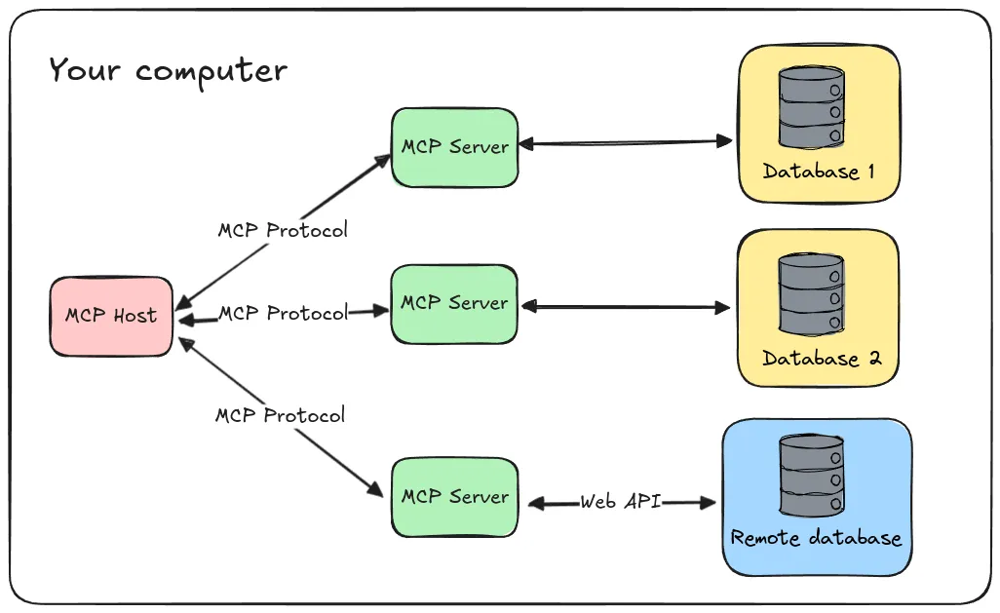
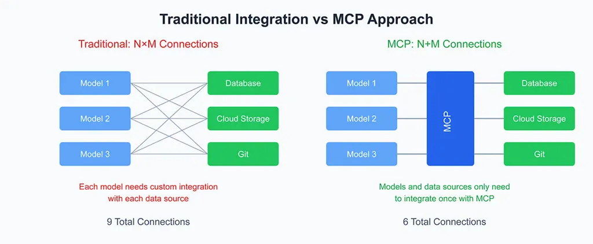

---
authors:
  - datnguyennnx
date: 2024-11-29
description: "Explore Anthropic's Model Context Protocol (MCP) - a groundbreaking approach to enhancing AI assistants. Learn how MCP integrates with local and remote resources, enabling smarter interactions with tools and databases."
tags:
  - llm
  - protocol
  - mcp
title: 'Intro to Model Context Protocol'
---

By making a new protocol known as the Model Context Protocol (MCP) open-source, Anthropic made a major change in AI. By overcoming the limitations of traditional data integration techniques and addressing the recurrent problem of data isolation, this protocol aims to enhance the connections between data hubs and AI systems.

## Understanding Model Context Protocol (MCP)

The Model Context Protocol (MCP) follows a client-host-server architecture where each host can run multiple client instances. This architecture enables users to integrate AI capabilities across applications while maintaining clear security boundaries and isolating concerns. MCP uses a client-server architecture with an emphasis on local-first connections. This choice reflects current concerns around privacy and security, especially as AI systems increasingly access sensitive data. Built on JSON-RPC, MCP provides a stateful session protocol focused on context exchange and sampling coordination between clients and servers.

MCP is a structured approach that allows AI systems to communicate effectively with various data sources and tools. It consists of several key components:

- **MCP host**: Programs like Claude Desktop, IDEs, or AI tools that want to access resources through MCP.
- **MCP clients**: Protocol clients that maintain 1:1 connections with servers.
- **MCP servers**: Lightweight programs that each expose specific capabilities through the standardized Model Context Protocol.
- **Local resources**: Your computer’s resources (databases, files, services) that MCP servers can securely access.
- **Remote resources**: Resources available over the internet (e.g., through APIs) that MCP servers can connect to.



## Integration multiple source for AI assistants

MCP significantly enhances AI assistants by enabling seamless integration with various data sources and tools. Here’s how:

- **Integration with data sources**: AI assistants can pull in relevant information from different databases, include platforms like Google Drive, Slack, GitHub, Git, Postgres, and Puppeteer.
- **Interaction with business tools**: MCP allows AI assistants to work directly with tools used in businesses, improving efficiency.
- **Interaction with local resources**: MCP server shares more than just data as well. In addition to resources (files, docs, data), they can expose tools (API integrations, actions) and prompts (templated interactions)

Examples of using the Claude Desktop as an MCP client ( MCP Host ) might look like:

```json
{
  "mcpServers": {
    "filesystem": {
      "command": "npx",
      "args": ["-y", "@modelcontextprotocol/server-filesystem", "/path/to/allowed/files"]
    },
    "git": {
      "command": "uvx",
      "args": ["mcp-server-git", "--repository", "path/to/git/repo"]
    },
    "github": {
      "command": "npx",
      "args": ["-y", "@modelcontextprotocol/server-github"],
      "env": {
        "GITHUB_PERSONAL_ACCESS_TOKEN": "<YOUR_TOKEN>"
      }
    },
    "postgres": {
      "command": "npx",
      "args": ["-y", "@modelcontextprotocol/server-postgres", "postgresql://localhost/mydb"]
    }
  }
}
```

## Perspectives and future developments

### AI agents and workflows are game-changers

AI agents are changing by the Model Context Protocol (MCP), which provides them with the resources they require to operate more effectively and intelligently. By allowing their seamless integration into different systems and data sources, MCP makes AI agents above their current capabilities of job automation and decision-making. MCP improves their performance in the following ways:

- **Speeds up tasks:** MCP makes it easier for agents to obtain the data they want, allowing them to finish tasks more quickly and without encountering data bottlenecks.
- **Handles growth easily:** MCP makes sure agents can easily adjust to new procedures or scale up to accommodate more users in order to meet evolving demands.
- **Makes better decisions:** MCP assists agents in making more informed decisions by providing them with up-to-date, precise data, which benefits both users and businesses.

MCP not only improves the performance of AI agents, but it also creates completely new opportunities for automation, creativity, and more intelligent business processes.


### MCP will be the new backbone of AI workflows

MCP that allows AI agents to connect with a variety of platforms and data sources using a standardized framework. With MCP, AI agents can transition from basic task automation to executing **complex, adaptable workflows**. This capability is a game-changer for industries looking to integrate AI seamlessly into [their operations](https://www.forbes.com/sites/janakirammsv/2024/11/04/why-agent-orchestration-is-the-new-enterprise-integration-backbone-for-the-ai-era/).

1. **Standardized interactions:** MCP gives AI a consistent approach to access and use data across platforms, local resource and more.
2. **Local-first architecture:** MCP prioritizes security, ensuring sensitive data is secured while providing frictionless processes.
3. **Open-source innovation:** MCP creates a robust context which supports continuous enhancement and innovation.



While there are several frameworks for developing AI agents, almost all of them rely on tools which make implement of the LLM's function-calling capabilities. Though it is the correct approach, this mechanism restricts the amount of tools and functions that the LLM may assign to a prompt or inquiry.

Anthropic's MCP significantly enhance AI agents' capabilities by allowing for direct, bidirectional communication with external systems. This development enables AI agents to retrieve real-time data from external databases, handle file systems, and connect smoothly with platforms such as GitHub. As a result, AI agents can do complicated activities independently, such as improving software development workflows, which increases productivity and reduces the need for manual intervention.

### Business adoption

One of the main challenges to enterprise adoption of AI is its integration. Every new AI tool that is implemented in a company usually needs a custom integration, which frequently leads to costly maintenance and time-consuming development. By offering pre-built interfaces for well-known enterprise platforms like GitHub, Google Drive, and PostgreSQL, MCP aims to simplify this process.

MCP is already being used by companies like Block and Apollo, showing how handy it is in real-world scenarios. Dev tool makers like Zed, Replit, and Codeium are also tapping into MCP to make their platforms better. Its popularity shows how it’s totally changing the game for how AI systems deal with and use data.

## Reference

- https://github.com/modelcontextprotocol
- https://www.anthropic.com/news/model-context-protocol
- https://github.com/modelcontextprotocol/servers/blob/main/src/github/index.ts
- https://medium.com/towards-applied-generative-ai/ai-agents-agentic-workflows-f558674ee18b
- https://www.metadocs.co/2024/11/29/anthropic-model-context-protocol-how-to-give-wings-to-local-mode/
- https://www.infoworld.com/article/3613143/anthropic-introduces-the-model-context-protocol.html
- https://salesforcedevops.net/index.php/2024/11/29/anthropics-model-context-protocol/
